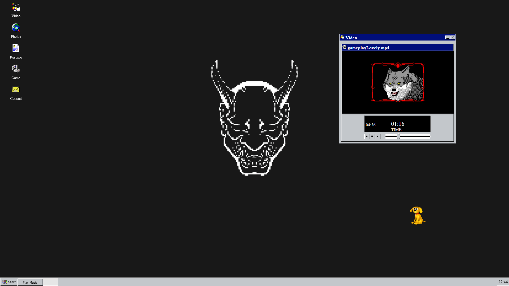

# 🖥️ My Retro Portfolio with React95

Welcome to my personal portfolio built using [React95](https://github.com/arturbien/React95) — a stylish React component library with Windows 95 UI vibes! 🎉

This project showcases my background, projects, skills, and contact information, all wrapped in a nostalgic retro interface.

---

## 🚀 Features

- 👨‍💻 Built with React and React95 UI components
- 📁 Windows 95-style desktop interface
- 🧠 About Me section
- 🛠️ Projects showcase with links
- ✉️ Contact modal
- 💾 Responsive layout

---

## 📸 Preview



---

## 🛠️ Technologies Used

- [React](https://reactjs.org/)
- [React95](https://github.com/arturbien/React95)
- Styled Components
- Vite / Create React App

---

## 📦 Installation

```bash
# Clone the repo
git clone https://github.com/RuyOllivere/Know-Me.git

# Navigate into the folder
cd Know-Me

# Install dependencies
npm install

# Run the development server
npm run dev
